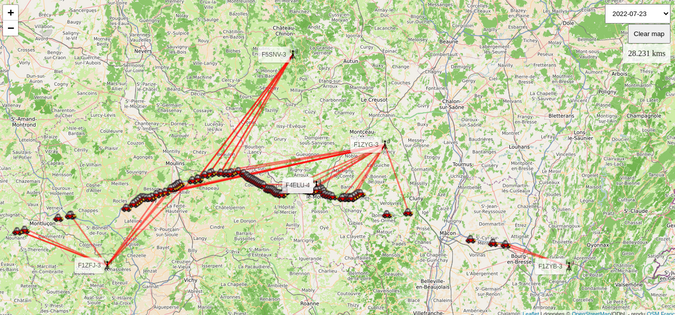

#APRS MAPS

This is simple visualisation system for your APRS frames. 



It is based on 2 tools :

 * a script which is converting the APRS frames into a JSON format
 * a webpage using OpenStreetMap to draw all the frames

## Frame conversion script

### Pre-requirements

Two python packages are required

```bash
pip install beautifulsoup4
pip install aprslib
```

### Usage

The usage is fairly simple. Write all frames in a file called `file_to_parse.txt` and following this format

```
2022-07-16 11:19:29 CEST: F4IHA>APFD01,F6KBN-3*,F8KGI-3*,F1ZYG-3*,qAR,F4VQS-3:!4707.30N/00025.49E>106/008/A=000118/V=5.12 HDOP=0
2022-07-16 13:40:17 CEST: F4IHA>APFD01,F6KBN-3*,F8KGI-3*,F1ZYG-3*,qAR,F4VQS-3:!4656.25N/00018.47E>197/033/A=000346/V=5.12 HDOP=0
```

Then run the Python script 

```bash
python3 convert.py
```

An output will provide all the details. The script will parse the `file_to_parse.txt`, extract the useful informations which will be write in json files (frames are grouped in a json file by day) and then archives into the `archives` folder with the date as filename.

## Webpage with the maps

### Usage

A simple way is to start a webserver with python. Any other HTTP webserver could be used.

```bash
python -m http.server
```

Then, open a browser to this address http://localhost:8000. It is centered around Lyon in France, but you can change the location by updating this line with your GPS coordinates.

```javascript
var carte = L.map('maCarte').setView([45.764043, 4.835659], 9);
```

On the top right, there is a dropdown menu which is providing multiple dates. Select one of them and you will see all frames appearing. If you go over a red line will appear between the location and the relay which receive the frame. You can see also on the right in a box the distance between these 2 points.

You can clear the map of all red lines with the _Clear map_ button. Selecting another day will clean also the maps from any frames and lines.